# 无损数据压缩
主要分为：字典编码，熵编码，其他。

# 字典编码
***

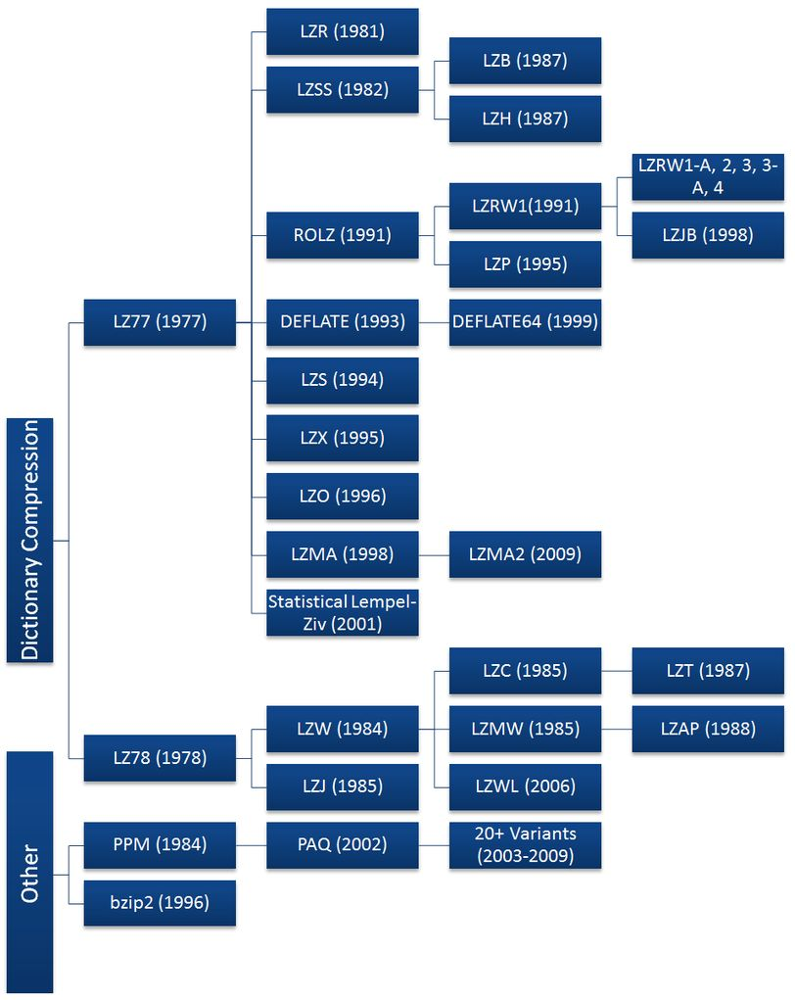  
## LZ77
LZ77算法是采用字典做数据压缩的算法，由以色列的两位大神Jacob Ziv与Abraham Lempel在1977年发表的论文《A Universal Algorithm for Sequential Data Compression》中提出。

基于统计的数据压缩编码，比如Huffman编码，需要得到先验知识——信源的字符频率，然后进行压缩。但是在大多数情况下，这种先验知识是很难预先获得。因此，设计一种更为通用的数据压缩编码显得尤为重要。LZ77数据压缩算法应运而生，其核心思想：利用数据的重复结构信息来进行数据压缩。

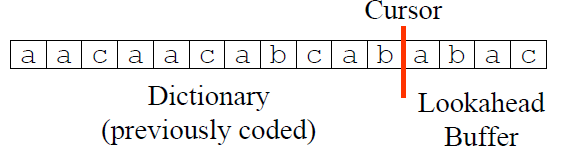  

在压缩时，LZ77算法将字符串分为两部分，一部分是已压缩的，一部分是未压缩的，LZ77算法的核心思想便是——用已压缩历史过的字符串作为未压缩部分的字典，以达到数据压缩的目的。在具体实现中，用滑动窗口（Sliding Window）字典存储历史字符，Lookahead Buffer存储待压缩的字符，Cursor作为两者之间的分隔。并且字典与Lookahead Buffer的长度是固定的。

### 压缩
用(p,l,c)表示Lookahead Buffer中字符串的最长匹配结果，其中
- p表示最长匹配时，字典中字符开始时的位置（相对于Cursor位置），
- l为最长匹配字符串的长度，
- c指Lookahead Buffer最长匹配结束时的下一字符

压缩的过程，就是重复输出(p,l,c)，并将Cursor移动至l+1
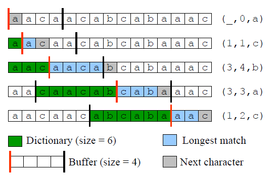  

### 解压
为了能保证正确解码，解压缩时的滑动窗口长度与压缩时一样。在解压缩，遇到(p,l,c)大致分为三类情况：
- p==0且l==0，即初始情况，直接解码c；
- p>=l，解码为字典dict[p:p+l+1]；
- p<l，即出现循环编码，需要从左至右循环拼接

## LZ78
在提出基于滑动窗口的LZ77算法后，两位大神Jacob Ziv与Abraham Lempel于1978年在发表的论文 [1]中提出了LZ78算法；与LZ77算法不同的是LZ78算法使用动态树状词典维护历史字符串。

### 压缩
LZ78算法的压缩过程非常简单。在压缩时维护一个动态词典Dictionary，其包括了历史字符串的index与内容；压缩情况分为三种：

1. 若当前字符c未出现在词典中，则编码为(0, c)；
2. 若当前字符c出现在词典中，则与词典做最长匹配，然后编码为(prefixIndex, lastChar)，其中，prefixIndex为最长匹配的前缀字符串，lastChar为最长匹配后的第一个字符；
3. 为对最后一个字符的特殊处理，编码为(prefixIndex,)。

下面给出3个例子
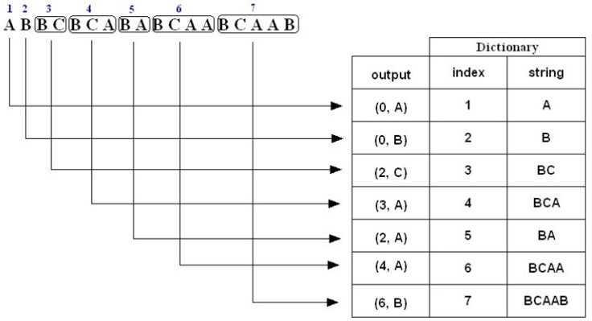  
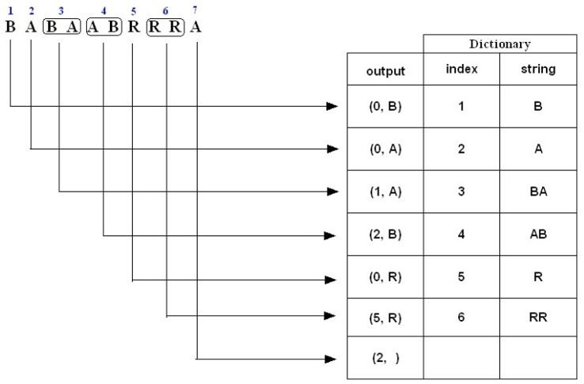  
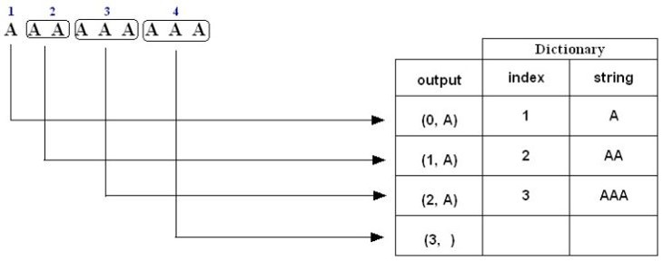  

### 解压
解压缩能更根据压缩编码恢复出（压缩时的）动态词典，然后根据index拼接成解码后的字符串。如下图所示：
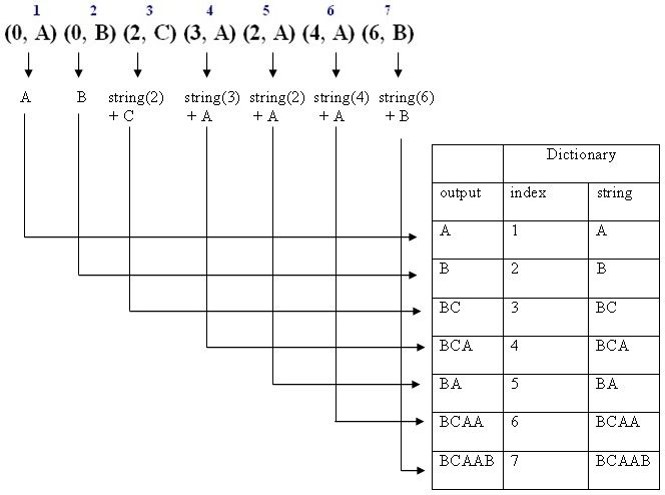  
前后拼接后，解压缩出来的字符串为“ABBCBCABABCAABCAAB”。

# 熵编码
***
## 信源编码定理
>在信息论中，香农的信源编码定理（或无噪声编码定理）确立了数据压缩的限度，以及香农熵的操作意义。信源编码定理表明（在极限情况下，随着独立同分布随机变量数据流的长度趋于无穷）不可能把数据压缩得码率（每个符号的比特的平均数）比信源的香农熵还小，又不丢失信息。但是有可能使码率任意接近香农熵，且损失的概率极小。码符号的信源编码定理把码字的最小可能期望长度看作输入字（看作随机变量）的熵和目标编码表的大小的一个函数，给出了此函数的上界和下界。

根据香农的信源编码定理，一个符号的最佳码长是$-log_b p$，其中 b 是用来输出的码的数目，p是输入符号出现的概率。在二进制编码中，在均匀分布的情况下，假定一个字符（或字符串）在文件中出现的概率是p，那么在这个位置上最多可能出现1/p种情况，对该字符（或字符串）需要$-log_2 p$个bit进行编码。整个文件的中，每个字符（或字符串）最少要占据$-sum_{i=0}^n p_i log_2 p_i$位。

## 哈夫曼编码
哈夫曼编码其实思想就是：对于更高频的符号，使用更短的编码。这样在对整个信息进行编码时，就可以进行大幅度压缩。比如一段字符：`3、6、4、3、4、3、4、3、5`，3出现了4次，4出现了3次，5出现了1次，6出现了1次。

如果我们用定长编码来进行信息编码，那么每个符号至少需要 2 个 bit 来表示：`3:00, 4:01, 5:10, 6:11`。编码长度为：$4*2 + 3*2 + 1*2 + 1*2 = 18 bit$。但是如果采用哈夫曼编码，对于出现频次更高的3和4，我们可以使用更短的编码。这里我们通过构造哈夫曼树来生成码字：
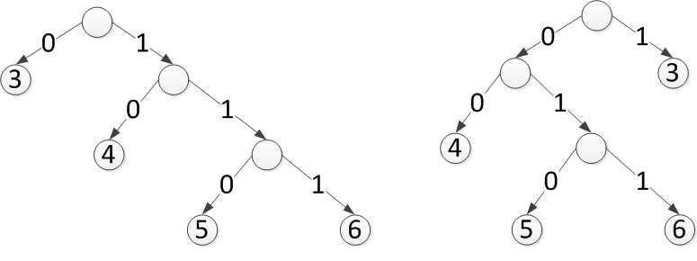  
我们把码树的任意节点的左右分支旋转（0、1互换），也可以称为树的左右互换，其实不影响编码长度，也就是说，这些码表其实都是一样好的，使用哪个都可以。我们选择左边的这棵树，这棵树有一个特点，越靠左边越浅，越往右边越深，是这些树中最不平衡的树。

因此编码规则为`3:0, 4:10, 5:110, 6:111`。整段字符的编码长度为$4*1 + 3*2+ 1*3 + 1*3 = 16 bit$，比之前的编码方式少了2bit.

### 不足
哈夫曼确实可以对数据进行压缩，但是无法逼近香农提出的熵极限。对于上面提出的3出现了4次，4出现了3次，5出现了1次，6出现了1次，按照香农的熵计算公式，整个字符串的信息熵应该是


$H(X) = -((4/9)*log_2 (4/9) + (3/9)*log_2 (3/9) + (1/9)*log_2 (1/9) + (1/9)*log_2 (1/9)) = 0.66\\
0.66*9 = 5.94
$
也就是这段字符的压缩极限为，平均每个符号用0.66个 bit 表示。整段字符一共9个字母，压缩极限为5.94个bit，约等于6个 bit，而采用哈夫曼编码时，我们只压缩到了16个bit。这是因为哈夫曼是采用整数进行符号编码的，不够精准，粒度不够细。


## 算术编码
算术编码的本质思想，也是对于高频的字符进行短编码，但是它的实现方式，完全和哈夫曼不同。假设某个字符的出现概率为 80%，该字符事实上只需要 $-log_2 0.8 = 0.322$ 位编码，但哈夫曼编码一定会为其分配一位 0 或一位 1 的编码。可以想象，整个信息的 80% 在压缩后都几乎相当于理想长度的 3 倍左右，压缩效果可想而知。

### 压缩
简单来说，算数编码做了这样一件事情：
1. 假设有一段数据需要编码，统计里面所有的字符和出现的次数。
2. 将区间 [0, 1) 连续划分成多个子区间，每个子区间代表一个上述字符， 区间的大小正比于这个字符在文中出现的概率 p。概率越大，则区间越大。所有的子区间加起来正好是 [0, 1)。
3. 编码从一个初始区间 [0, 1) 开始，设置: $low=0，high=1$
4. 不断读入原始数据的字符，找到这个字符所在的区间，比如 [L, H)，更新:$low=low+(high−low)∗L$  $high=low+(high−low)∗H$
5. 最后将得到的区间[low, high)中任意一个小数以二进制形式输出即得到编码的数据。

以`ARBER`为例，统计它们出现的次数和概率：`A:0.2, B:0.2, C:0.2, R:0.4`,将这几个字符的区间在 [0, 1) 上按照概率大小连续一字排开，我们得到一个划分好的 [0, 1)区间：
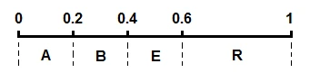  
开始编码，初始区间是 [0，1)。注意这里又用了区间这个词，不过这个区间不同于上面代表各个字符的概率区间 [0，1)。这里我们可以称之为编码区间，这个区间是会变化的，确切来说是不断变小。我们将编码过程用下图完整地表示出来：
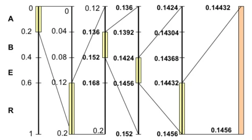  
拆解开来一步一步看：
1. 刚开始编码区间是 [0，1)
2. 第一个字符A的概率区间是 [0，0.2)，则 L = 0，H = 0.2，更新$low=0, high=0.2$
3. 第二个字符R的概率区间是 [0.6，1)，则 L = 0.6，H = 1，更新$low=0.12, high=0.2$
4. 第三个字符B的概率区间是 [0.2，0.4)，则 L = 0.2，H = 0.4，更新$low=0.136, high=0.152$
5. ...

上面的图已经非常清楚地展现了算数编码的思想，我们可以看到一个不断变化的小数编码区间。每次编码一个字符，就在现有的编码区间上，按照概率比例取出这个字符对应的子区间。例如一开始A落在0到0.2上，因此编码区间缩小为 [0，0.2)，第二个字符是R，则在 [0，0.2)上按比例取出R对应的子区间 [0.12，0.2)，以此类推。每次得到的新的区间都能精确无误地确定当前字符，并且保留了之前所有字符的信息，因为新的编码区间永远是在之前的子区间。最后我们会得到一个长长的小数，这个小数即神奇地包含了所有的原始数据.
### 解压
从编码得到的小数开始，不断地寻找小数落在了哪个概率区间，就能将原来的字符一个个地找出来。例如得到的小数是0.14432，则第一个字符显然是A，因为它落在了 [0，0.2)上，接下来再看0.14432落在了 [0，0.2)区间的哪一个相对子区间，发现是 [0.6，1)， 就能找到第二个字符是R，依此类推。

# 实现实例
- DEFLATE：（又名Zip）  
    这是最经典且几乎普遍采用的无损压缩方法。它最初是在大约 30 年前（1991 年）引入的，因此可以假定它是所有这些中最古老的癸烷。
- LZMA：（又名7-Zip）  
    这是一种众所周知且广泛采用的无损压缩方法。它比大约 20 年前（1998 年）推出的 DEFLATE 还要年轻。LZMA 是无损压缩的极端实现。它通常能够实现非常令人印象深刻的压缩比（远远好于 DEFLATE），但要以压缩速度为代价。LZMA 很容易变得非常缓慢。
- LZ4  
    这是一种更现代的算法，在不到 10 年前（2011 年）引入，所以它的使用仍然相当有限。LZ4 也是无损压缩的极端实现，但与 LZMA 完全不同。它经过了极大的优化，速度极快，但以较低的压缩比为代价。
- ZSTD（又名Zstandard）  
    这是一种最近引入的算法（2015），它的采用仍然相当有限。
    奇怪的是，LZ4 和 ZSTD 都是由同一作者（Yann Collet）开发和维护的。ZSTD 是一种平衡良好的算法，旨在成为 DEFLATE 的现代替代品，能够更快和/或实现更好的压缩比。关于 ZSTD 引入的最相关创新的一些技术细节：
    - 旧的 DEFLATE 被设计为需要非常有限的内存量，这在许多方面损害了它的效率。现代硬件可以轻松支持大量内存，因此 ZSTD 借鉴了 LZMA 的一些想法，即使用更少约束和更高效的内存分配。更具体地说，DEFLATE 基于一个32KB的移动数据窗口；LZMA 和 ZSTD 都采用更大的尺寸（1MB）作为移动窗口。
    - DEFLATE 和 ZSTD 都采用经典的Huffman 编码来降低信息熵。但是 ZSTD 还可以支持基于有限状态熵的更高级机制，这是一种速度更快的最新技术。

***
## DEFLATE
这是最经典且几乎普遍采用的无损压缩方法。它最初是在大约 30 年前（1991 年）引入的。

以压缩字符串`生，容易。活，容易。生活，不容易。`为例。
### LZ77编码
首先使用LZ77算法。
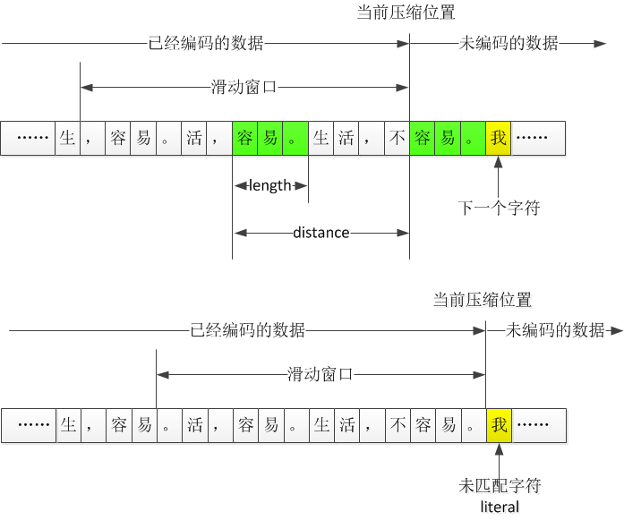  
当然，如果仔细对比的话，zip中使用的算法和LZ提出来的LZ77算法其实还是有差异的，思想基本是相同的，LZ77 算法一般称为“滑动窗口压缩”，我们前面说过，该算法的核心是在前面的历史数据中寻找重复字符串，但如果要压缩的文件有100MB，是不是从文件头开始找？

不是，这里就涉及前面提过的一个规律，重复现象是具有局部性的，它的基本假设是，如果一个字符串要重复，那么也是在附近重复，远的地方就不用找了，因此设置了一个滑动窗口，zip中设置的滑动窗口是32KB，那么就是往前面32KB的数据中去找，这个32KB随着编码不断进行而往前滑动。

当然，理论上讲，把滑动窗口设置得很大，那样就有更大的概率找到重复的字符串，压缩率不就更高了？

初看起来如此，找的范围越大，重复概率越大，不过仔细想想，可能会有问题，一方面，找的范围越大，计算量会增大，不顾一切地增大滑动窗口，甚至不设置滑动窗口，那样的软件可能不可用，你想想，现在这种方式，我们在压缩一个大文件的时候，速度都已经很慢了，如果增大滑动窗口，速度就更慢，从工程实现角度来说，设置滑动窗口是必须的；另一方面，找的范围越大，距离越远，出现的距离很多，也不利于对距离进行进一步压缩吧，我们前面说过，距离和长度最好出现的值越少越好，那样更好压缩，如果出现的很多，如何记录距离和长度可能也存在问题。

不过，我相信滑动窗口设置得越大，最终的结果应该越好一些，不过应该不会起到特别大的作用，比如压缩率提高了5%，但计算量增加了10倍，这显然有些得不偿失。

在第一个图中，“容易。”是一个重复字符串，距离distance=5，字符串长度length=3。

当对这三个字符压缩完毕后，接下来滑动窗口向前移动3个字符，要压缩的是“我…”这个字符串，但这个串在滑动窗口内没找到，所以无法使用distance+length的方式记录。这种结果称为literal。literal的中文含义是原义的意思，表示没有使用distance+length的方式记录的那些普通字符。
### 哈夫曼编码
上面LZ压缩结果有三类（literal、distance、length），对于这些数据我们仍可以对其进行过二次压缩，以distance为例。

假如对一个文件进行LZ压缩后，得到的distance值为：`3、6、4、3、4、3、4、3、5`，这个例子里，3出现了4次，4出现了3次，5出现了1次，6出现了1次。
  
通过使用上述哈夫曼编码后我们得到了编码后的数据，但是哈夫曼树我们应该使用什么方式才能把一棵树用最少的bit存储下来呢？

在zip中使用嘴边的这棵树，通过使用记录码字长度的方式记录下这棵树。比如，一个有效的码表是`0–>3；10–>4；110–>5；111–>6`，只需要记录这个对应关系即可
```
3　　4　　5　　6
1　　2　　3　　3
```
也就是说，把1、2、3、3记录下来，解压一边照着左边那棵树的形状构造一颗树，然后只需要1、2、3、3这个信息自然就知道是0、10、110、111，同时distance的范围是1-32768，按照这个顺序记录就能把distance和对应的编码联系起来。

所以记录下来的码字长度序列为：  
`0、0、1、2、3、3、0、0、0、0、0、......`

这样就知道构造出来的码字对应哪个整数了吧，但因为distance可能的值很多（32768个），但实际出现的往往不多，中间会出现很多0，这就给了我们继续优化的可能。

### 再优化
我们明白，每个distance肯定对应唯一一个码字，使用Huffman编码可以得到所有码字，但是因为distance可能非常多，虽然一般不会有32768这么多，但对一个大些的文件进行LZ编码，distance上千还是很正常的，所以这棵树很大，计算量、消耗的内存都容易超越了那个时代的硬件条件，那么怎么办呢？

zip中把distance划分成多个区间，每个区间当做一个整数来看，这个整数称为Distance Code。当一个distance落到某个区间，则相当于是出现了那个Code，多个distance对应于一个Distance Code，Distance虽然很多，但Distance Code可以划分得很少，只要我们对Code进行Huffman编码，得到Code的编码后，Distance Code再根据一定规则扩展出来。

越小的距离，出现的越多；越大的距离，出现的越少，所以这种区间划分不是等间隔的，而是越来越稀疏的，类似于下面的划分：
  
1、2、3、4这四个特殊distance不划分，或者说1个Distance就是1个区间；5,6作为一个区间；7、8作为一个区间等等，基本上，区间的大小都是1、2、4、8、16、32这么递增的，越往后，涵盖的距离越多。

### 再再优化
前面我们已经分析了，Huffman码树用一个码字长度序列表示，称为CL（Code Length）。这里仍然沿用 Huffman 的想法，因为CL也是一堆整数，那么当然可以再次应用Huffman编码。不过在这之前，zip中先对CL序列做了游程编码。做完游程编码后得到SQ序列，然后再应用哈夫曼编码。

对于Literal与length也有类似的过程。

当（literal、distance、length）都做完压缩后，在进行哈夫曼编码。最后再用一些技巧将哈夫曼编码存储下来。

这里不再赘述压缩过程，只需要知道每一次压缩后，zip都会根据当前压缩结果的特性继续做压缩。一般第一次压缩算法会选择字典编码，后续压缩算法会选择熵编码。

### 整体流程
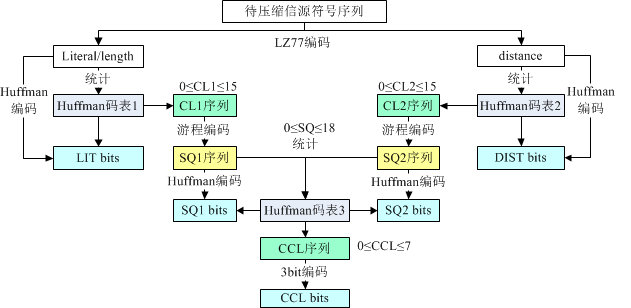  

## Zstandard
由 Zstandard 压缩的内容被转换为 Zstandard frame（这里称其为帧，非官方翻译）。多个帧可以附加到单个文件或流中。一个帧是完全独立的，有一个定义的开始和结束，以及一组告诉解码器如何解压缩它的参数。

一个帧封装一个或多个块。每个块包含任意内容，由其标题描述，并具有保证的最大内容大小，这取决于帧参数。与帧不同，每个块都依赖于先前的块进行正确解码。但是，每个块都可以在不等待其后续块的情况下解压缩，从而允许流式操作。

整体架构如下：
- 帧
  - Zstandard 帧
    - Blocks
      - Literals 部分
      - Sequences 部分
      - Sequence Execution
    - Skippable 帧
- 熵编码
  - FSE（一种基于ANS的熵编解码器）
  - 哈夫曼编码
- Dictionary Format

Zstandard 压缩数据由一帧或多帧组成。每个帧都是独立的，可以独立于其他帧进行解压缩。多个拼接帧的解压内容就是每帧解压内容的拼接。

Zstandard 定义了两种帧格式：Zstandard 帧和 Skippable 帧。Zstandard 帧包含压缩数据，而Skippable 帧包含自定义用户元数据。
# 附录
***
## 参考资料
https://zh.wikipedia.org/wiki/%E6%95%B0%E6%8D%AE%E5%8E%8B%E7%BC%A9  
https://zh.wikipedia.org/wiki/DEFLATE  
https://www.cnblogs.com/en-heng/p/4992916.html  
https://www.cnblogs.com/en-heng/p/6283282.html  
https://houbb.github.io/2018/11/09/althgorim-compress-althgorim-12-zip-02  
https://github.com/facebook/zstd/blob/dev/doc/zstd_compression_format.md  
https://segmentfault.com/a/1190000011561822  
https://facebook.github.io/zstd/  

## 代码
```python
# coding=utf-8

class LZ77:
    """
    A simplified implementation of LZ77 algorithm
    """

    def __init__(self, window_size):
        self.window_size = window_size
        self.buffer_size = 4

    def longest_match(self, data, cursor):
        """
        find the longest match between in dictionary and lookahead-buffer
        """
        end_buffer = min(cursor + self.buffer_size, len(data))

        p = -1
        l = -1
        c = ''

        for j in range(cursor+1, end_buffer+1):
            start_index = max(0, cursor - self.window_size + 1)
            substring = data[cursor + 1:j + 1]

            for i in range(start_index, cursor+1):
                repetition = len(substring) / (cursor - i + 1)
                last = len(substring) % (cursor - i + 1)
                matchedstring = data[i:cursor + 1] * repetition + data[i:i + last]

                if matchedstring == substring and len(substring) > l:
                    p = cursor - i + 1
                    l = len(substring)
                    c = data[j+1]

        # unmatched string between the two
        if p == -1 and l == -1:
            return 0, 0, data[cursor + 1]
        return p, l, c

    def compress(self, message):
        """
        compress message
        :return: tuples (p, l, c)
        """
        i = -1
        out = []

        # the cursor move until it reaches the end of message
        while i < len(message)-1:
            (p, l, c) = self.longest_match(message, i)
            out.append((p, l, c))
            i += (l+1)
        return out

    def decompress(self, compressed):
        """
        decompress the compressed message
        :param compressed: tuples (p, l, c)
        :return: decompressed message
        """
        cursor = -1
        out = ''

        for (p, l, c) in compressed:
            # the initialization
            if p == 0 and l == 0:
                out += c
            elif p >= l:
                out += (out[cursor-p+1:cursor+1] + c)

            # the repetition of dictionary
            elif p < l:
                repetition = l / p
                last = l % p
                out += (out[cursor-p+1:cursor+1] * repetition + out[cursor-p+1:last] + c)
            cursor += (l + 1)

        return out


if __name__ == '__main__':
    compressor = LZ77(6)
    origin = list('aacaacabcabaaac')
    pack = compressor.compress(origin)
    unpack = compressor.decompress(pack)
    print pack
    print unpack
    print unpack == 'aacaacabcabaaac'
```

```python
# -*- coding: utf-8 -*-
# A simplified implementation of LZ78 algorithm
def compress(message):
    tree_dict, m_len, i = {}, len(message), 0
    while i < m_len:
        # case I
        if message[i] not in tree_dict.keys():
            yield (0, message[i])
            tree_dict[message[i]] = len(tree_dict) + 1
            i += 1
        # case III
        elif i == m_len - 1:
            yield (tree_dict.get(message[i]), '')
            i += 1
        else:
            for j in range(i + 1, m_len):
                # case II
                if message[i:j + 1] not in tree_dict.keys():
                    yield (tree_dict.get(message[i:j]), message[j])
                    tree_dict[message[i:j + 1]] = len(tree_dict) + 1
                    i = j + 1
                    break
                # case III
                elif j == m_len - 1:
                    yield (tree_dict.get(message[i:j + 1]), '')
                    i = j + 1


def uncompress(packed):
    unpacked, tree_dict = '', {}
    for index, ch in packed:
        if index == 0:
            unpacked += ch
            tree_dict[len(tree_dict) + 1] = ch
        else:
            term = tree_dict.get(index) + ch
            unpacked += term
            tree_dict[len(tree_dict) + 1] = term
    return unpacked


if __name__ == '__main__':
    messages = ['ABBCBCABABCAABCAAB', 'BABAABRRRA', 'AAAAAAAAA']
    for m in messages:
        pack = compress(m)
        unpack = uncompress(pack)
        print(unpack == m)
```